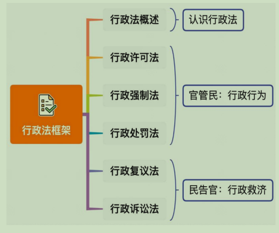
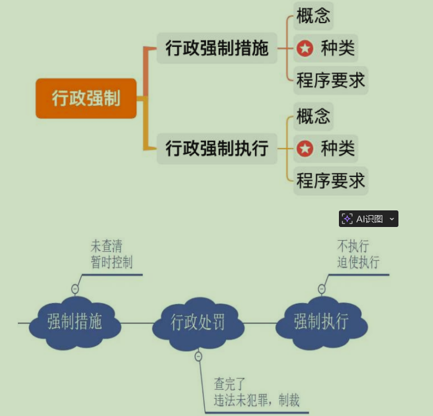

- [1. 框架](#1-框架)
- [2. 行政强制框架](#2-行政强制框架)
- [3. 概念](#3-概念)
- [4. 种类（口诀：先封洞口）](#4-种类口诀先封洞口)
- [5. 程序要求](#5-程序要求)
  - [5.1. 查封、扣押的程序](#51-查封扣押的程序)
  - [5.2. 冻结的程序](#52-冻结的程序)

# 1. 框架



# 2. 行政强制框架


1.强制措施：一般发生在<font color=red>作出处罚决定之前</font>，在事情未查清的情况下起到暂时控制作用。

2.强制执行：发生在作出处罚决定之后，不执行行政决定、迫使执行时出现。

3.如粉笔涉嫌偷税漏税：

    （1）税务机关担心调查期间粉笔转移财产，会先冻结粉笔的账户，钱还在
    账户里，只是防止粉笔转移财产，起到暂时控制作用。经调查发现粉笔确实偷税
    漏税，可以对其作出处罚决定。

    （2）如作出罚款 50 万的处罚决定，作出处罚决定后，粉笔交了罚款即可。
若粉笔不交罚款则会强制执行，比如划拨账户里的钱、拍卖房或车等。


# 3. 概念
行政强制措施是指行政机关在行政管理过程中，为制止违法行为、防止证据损毁、避免危害发生、控制危险扩大等情形，依法对公民的人身自由实施<font color=red>暂时性限制</font>，或者对公民、法人或者其他组织的财物实施<font color=red>暂时</font>性控制的行为。

# 4. 种类（口诀：先封洞口）
1. 限制公民人身自由（强制隔离、强制戒毒、约束至酒醒等）。
2. 查封场所、设施或者财物。
3. 扣押财物。
4. 冻结存款、汇款。
5. 其他行政强制措施。

```

```

<details>
  <summary>【解析】行政强制措施：</summary>
1.概念：不需要背，能理解即可。为制止违法行为、防止危险扩大，依法对
公民的人身或财产采取的暂时性控制的行为。
（1）如为了防止粉笔转移财产，冻结粉笔的账户，不影响钱的所有权，只
是暂时不能用。
3
（2）比如甲喝了几瓶酒，醉酒驾驶机动车，被交警发现，无论甲酒醒后追
究他什么样的责任，当下交警不会让其在醉酒的情况下继续开车。
①为了制止违法行为，防止危险扩大（如甲掉沟里或撞到人），交警会将其
约束至酒醒，约束多久要看甲何时酒醒，酒醒后解除约束。
②目的是制止其违法行为，防止危险扩大，对其人身进行暂时限制，属于强
制措施。
2.强制措施的种类（重点）：会和行政处罚、行政强制措施、行政强制执行
混淆考查，口诀“先（1）封（2）洞（4）口（3）”。
（1）限制公民人身自由：行政处罚中的行政拘留也会限制人身自由，但是
法律明确规定行政拘留属于行政处罚，此处讲的限制公民人身自由是除了行政拘
留以外的，题干中的表现形式多种多样，如强制隔离、强制戒毒、强制约束至酒
醒等。
（2）查封场所、设施或者财物：比如粉笔的厂房被贴封条，厂房还是粉笔
的，所有权不影响，但是暂时限制使用。再如交警大队扣了甲的车，并不是没收，
调查完了会还给甲，只是起到暂时控制作用。
（3）扣押财物。
（4）冻结存款、汇款：钱还是粉笔的，只是进不去、出不来。
</details>

# 5. 程序要求
## 5.1. 查封、扣押的程序
（1）不得查封、扣押与违法行为<font color=red>无关</font>的场所、设施或者财物；不得查封、
扣押公民个人及其所扶养家属的生活<font color=red>必需品</font>；当事人的场所、设施或者财物已被其他国家机关依法查封的，<font color=red>不得重复查封</font>。（三个不得）

（2）行政机关决定实施查封、扣押的，应当履行法定程序，制作并当场交
付查封、扣押决定书和清单。查封、扣押清单一式二份，由当事人和行政机关分
别保存。（一式二份）

（3）查封、扣押的期限不得超过 30 日；情况复杂的，经行政机关负责人批
准，可以延长，但是延长期限不得超过 30 日。法律、行政法规另有规定的除外。
延长查封、扣押的决定应当及时书面告知当事人，并说明理由。（30+30）

（4）对查封、扣押的场所、设施或者财物，行政机关应当妥善保管，不得
使用或损毁，保管费用由行政机关承担；造成损失的，应当承担赔偿责任。（妥
善保管）

<details>
<summary>查封、扣押的程序：</summary>
1.三个不得：
（1）不得查封、扣押与违法行为无关的场所、设施或者财物：涉案的、有
关的才能查封。
（2）不得查封、扣押公民个人及其所扶养家属的生活必需品：如全家只有
一套房，则不能查封，让其一家人睡在马路上。“生活必需品”没有明确的法律
规定，需要行政机关执法时自由裁量。考试时知道生活必需品不能查扣即可。
（3）不得重复查封：如粉笔的厂房被一个机关查封，同一时间其他机关不
得查封（已经查封，重复查封只是起到加固作用）。当这个机关查封的期限到期
后，其他机关才能查封。
2.行政机关决定实施查封、扣押的，应当履行法定程序，制作并当场交付查
封、扣押决定书和清单。查封、扣押清单一式二份，由当事人和行政机关分别保
存。
（1）制作书面的查封、扣押决定书和清单，不能以口头方式告知要查封、
扣押，原则上要求制作书面的查封、扣押决定书。
（2）清单（扣押了什么，要写清楚）一式二份，官民各一份，主要是为了
留作证据。比如扣了修正药业 50 箱毒胶囊，事后修正药业说扣了 100 箱毒胶囊，
容易产生争议。
3.期限：一般情况下期限不得超过 30 日；情况复杂的，经行政机关负责人
批准（基层人员不能自己决定延长），可以延长，但是延长期限不得超过 30 日
（30+30，最长 60 日，只能延长一次，不得反复延长。如果可以反复延长，那么
法律规定的期限无意义）。
4.妥善保管：
（1）对查封、扣押的场所、设施或者财物，行政机关应当妥善保管，不得
使用或损毁，保管费用由行政机关承担；造成损失的，应当承担赔偿责任。如交
警队扣押甲的车，将甲的车辆暂时作为公车导致车辆损害，要修好，修不好要赔偿。
（2）保管费用由行政机关承担：如交警队扣的车太多，停车场放满、停不
下了，交警把车放在社会停车场，产生保管费用，保管费用应该由行政机关承担，
不允许向百姓收费。现实情况中若向老百姓收费则是违法的。
</details>


## 5.2. 冻结的程序

(1) 冻结存款、汇款的数额应当与违法行为涉及的金额相当；已被其他国
家机关依法冻结的，不得重复冻结。

(2)自冻结存款、汇款之日起 30 日内，行政机关应当作出处理决定或者作
出解除冻结决定；情况复杂的，经行政机关负责人批准，可以延长，但是延长期
限不得超过 30 日。

(3)行政机关逾期未作出处理决定或者解除冻结决定的，金融机构应当自
冻结期满之日起解除冻结。

<details>
<summary>冻结的程序：</summary>

1.冻结存款、汇款的数额应当与违法行为涉及的金额相当；已被其他国家机
关依法冻结的，不得重复冻结：
（1）冻结存款、汇款的数额应当与违法行为涉及的金额相当：不能为了交
500 罚款，把账户里 500 万冻结。上节课讲解行政法基本原则时讲过，手段必须
适当，不能极端，不能大炮打小鸟、杀鸡用宰牛刀。基于比例原则，手段要适当，
为了 500 罚款冻结 500 万超出了必要的限度，对百姓造成的损害太大。
（2）已被其他国家机关依法冻结的，不得重复冻结：一个机关冻结期间，
其他机关在同一时间不得再冻结。
2.冻结的时间：自冻结存款、汇款之日起 30 日内，行政机关应当作出处理
决定或者作出解除冻结决定；情况复杂的，经行政机关负责人批准（基层人员不
得自己决定），可以延长，但是延长期限不得超过 30 日。与查封扣押可以一起记
忆，即 30+30 日，最长 60 日（只能延长一次）。
3.解冻：正常情况下期满后行政机关要作出解除冻结的决定。行政机关逾期
未作出处理决定或者解除冻结决定的，不能放任行政机关的违法行为，法律规定
金融机构应当自冻结期满之日起解除冻结（考查过银行等着还是自己解除冻结）。
</details>