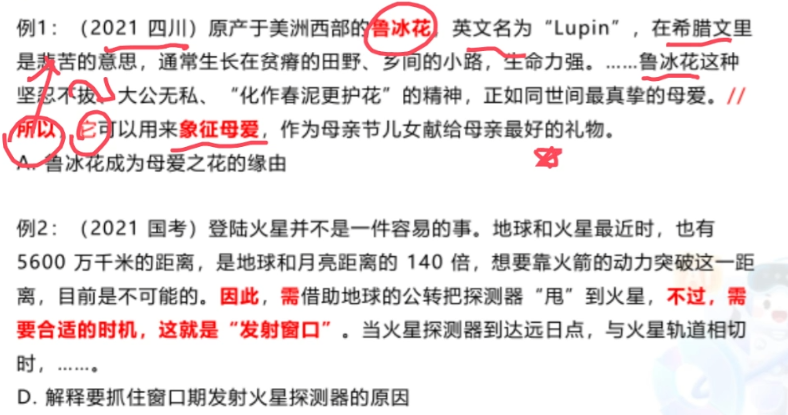

# 1. 原因 + 结论
- 因为......所以....
- 由于......因此....

# 2. 直接引导结论
这种一般是用原因解释的关联词
- 所以
- 因此
- 因而
- 故而
- 故
- 于是
- 可见
- 看来

变形考法：
- 在这种情况下、对此、可以说、换言之、总之、可以说、简而言之、换句话说、有鉴于此等

指示代词:前文出现多个列举，后文来一个**指示代词**
- **这些**
- **在此基础上**

# 3. 核心
结论才是重点，解释都是啰里啰唆，在解释重结论有点像对解释的顺承

# 4. 文段/选项特征
文段结构：
- 结论 + 原因解释
- 原因 + 结论

正确选项：
- 直接选结论
- 解释**结论**的原因（包含了结论的原因要选择）

# 5. 结论句出现在文段开头/中间，之后仍有其他语句：
（1）之后的语句是进一步解释说明，此时中心句仍为结论句

（2）之后又出现并列、因果、转折、对策等，需结合多种关联关系共同分析