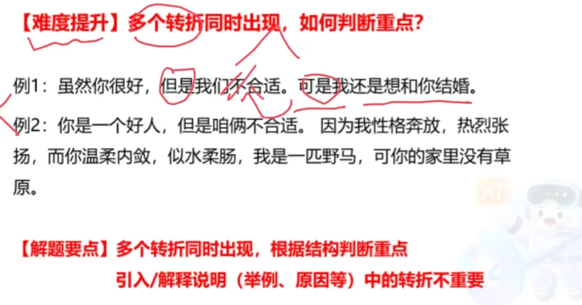

# 1. 题目问法
- 这段文字主要 / 旨在 / 重在 / 意在 / 想要说明（论述、强调）的是…… 
- 这段文字的主旨 / 主题 / 观点是……
- 对这段文字概括最恰当的一项是…… 
- 这段文字表达了作者……
- 从这段文字中我们可以看出作者的意图 / 态度是…… 
- ……

# 2. 常见转折
1. 虽然.....但是...;
2. 尽管....可是..;
3. .....不过.....;
4. ......然而.....;
5. ....却.....;
6. 其实/事实上/实际上

转折后面是重点：

你很好，**但是**我喜欢小红

重点是我喜欢小红

# 3. 多个转折同时出现

  
- 不一定是最后一个转折重要，主要分析文段主要在讲什么
