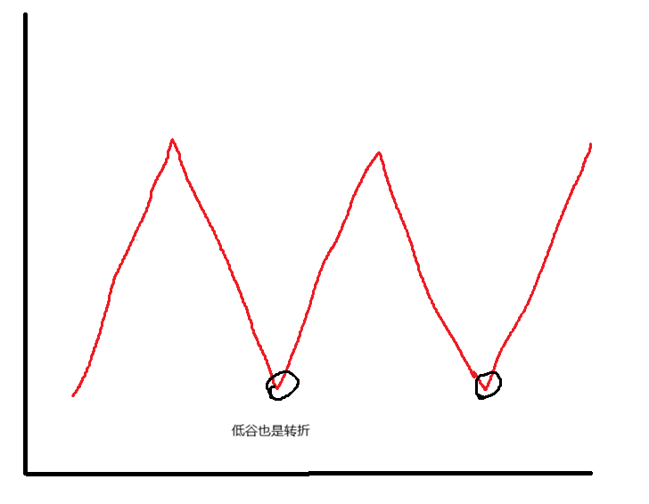

2026/4/24
# 生存就是资源竞争
普通人的生存，本质就是资源的紧张，过的好或者不好其实都是竞争的结果，如同现在的考公，考编，考研三个大军一样，有人成功，有人失败，几家欢喜，几家愁，有点像生物学，优胜劣汰了，品种优秀的生存下来繁衍后代，失败的被淘汰，然后在优秀范围内的，后代又开始竞争-繁衍，最终选出更加优良品种，

# 普通人该如何生存
## 专精
在一个领域做大做强，只深入一个领域，如果认为是正确的就拼命去做，比如现在自己认为是考事业编，那么就猛攻事业编，相信终有一天会柳暗花明.

## 博文
前面说的是一个方向的深入，这里就是多个方向的广度，只有博文，才能知道该向哪个方向走，博文其实是有利于一个方向的深入的，虽然世界是分为多个学科多个方向，但是世界其实原本只有一个学科，博文能很好的将世界系统性的联系起来

## 实践
实践上有想法的人是多数，但是真正落实的人却是少数，不管成功与否，先去试下，只有去做，才能认识到自己的差距

## 抗压
这可能是走向强者之路与变成普通人的本质属性，有些人经历了失败一蹶不振，有些人经历失败越挫越勇,低谷的极致就是人生的转折点.

- 要抗压就要认清现实，不要觉得自己就应该怎么样
- 不要觉得失败就是发挥不好

失败就是失败，失败才是人生的常态，允许失败，从失败中找问题，求方法，找差距，才能成长，失败不可耻，可耻的是觉得失败全天下都该欠我的，应该以自己为中心

## 时间/精力
不管是优良品种，还是劣势品种，其基本的时间是相同的，一天都是24h，一年都约365天，有效利用时间，不要把时间浪费到无关紧要的事情上，比如刷抖音，一个标题含糊不清，看了半天也看不出所以然，还有无效娱乐，用打游戏争排名来麻痹自己，确实游戏通过时间的叠加能有一个客观的排名（那时候心情舒畅，觉得自己真的厉害），但是真的厉害吗？人的是有限了，以我自己为例一天专注时间，即使做自己喜欢的东西很难8h，一天也就是24小时，加入睡8h + 吃饭2h + 抖音2h + 游戏2h = 14h,那么一天只有10小时做事情的时间，且不说前者还是理想情况，并且还没算社交等时间，一天的真正专研时间有多少恐怕只会更少，因为时间几乎不可能连贯（当出社会后），上午搞几个小时中午要吃饭，下午又来

所以不要把时间浪费到短视频和无效娱乐上面

# 认清现实
知道自己的定位，知道自己的差距，不要活在一个精神胜利的世界中

# 梦想
梦想是对未来的憧憬，是前进的方向和动力，人无梦想和咸鱼有什么区别

# 总结
能做到上面的已经超过90%的人了

